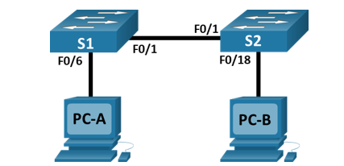

# Лабораторная работа. Просмотр таблицы MAC-адресов коммутатора

#### Топология:

#### Таблица адресации;

#### Часть 1 Создание и настройка сети:

##### базовые параметры каждого коммутатора:
[коммутатор S1-базовая настройка](config/S1-config)

[коммутатор S2-базовая настройка](config/S2-config)

#### Часть 2. Изучение таблицы МАС-адресов коммутатора

##### _Запишите МАС-адреса сетевых устройств:_

a.

[MAC-адрес компьютера PC-A:](config/PC-A-mac)   0001.975E.08A9

[MAC-адрес компьютера PC-B:](config/PC-B-mac) 0004.9AC6.70D4

b.

[МАС-адрес коммутатора S1 Fast Ethernet 0/1:](config/S1-interface) 0007.ec35.8401

[МАС-адрес коммутатора S2 Fast Ethernet 0/1:](config/S2-interface) 0002.4a76.6601