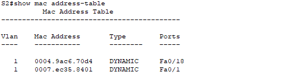

# Лабораторная работа. Просмотр таблицы MAC-адресов коммутатора

#### Топология:


#### Таблица адресации;


#### Часть 1 Создание и настройка сети:

##### базовые параметры каждого коммутатора:
[коммутатор S1-базовая настройка](config/S1-config)

[коммутатор S2-базовая настройка](config/S2-config)

#### Часть 2. Изучение таблицы МАС-адресов коммутатора

##### _1. Запишите МАС-адреса сетевых устройств:_

a.

[MAC-адрес компьютера PC-A:](config/PC-A-mac)   0001.975E.08A9

[MAC-адрес компьютера PC-B:](config/PC-B-mac) 0004.9AC6.70D4


b.

[МАС-адрес коммутатора S1 Fast Ethernet 0/1:](config/S1-interface) 0007.ec35.8401

[МАС-адрес коммутатора S2 Fast Ethernet 0/1:](config/S2-interface) 0002.4a76.6601

##### _2. Просмотрите таблицу МАС-адресов коммутатора S2

```
show mac address-table
```


MAC-адрес 0004.9ac6.70d4 связан с портом Fa0/18 и типом DYNAMIC в VLAN 1

MAC-адрес 0007.ec35.8401 связан с портом Fa0/1 и типом DYNAMIC в VLAN 1

##### _Чтобы определить к каким устройствам принадлежат мас-адреса можно:_

_1. Если есть доступ к коммутатору, то можно посмотреть физически подключенные устройства к портам Fa0/18 и Fa0/1. Такая проверка может быть не всегда возможна в больших сетях._

_2. С помощью команды ``` show arp ``` по ip-адресам можно узнать каким устройствам принадлежат mac-адреса._<br/>
_Команда ARP работает только на уровне локальной сети, поэтому она не сможет помочь, если устройство находится в другой подсети или если ARP-кеш был очищен._


##### 3. Очистите таблицу МАС-адресов коммутатора S2 и снова отобразите таблицу МАС-адресов.


