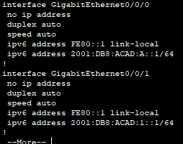
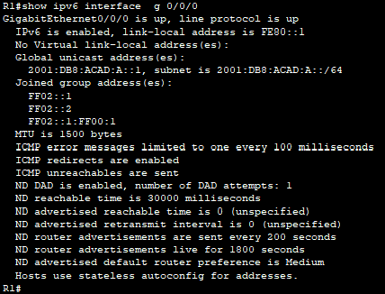
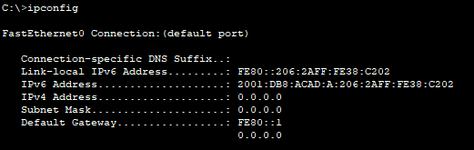
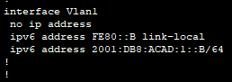
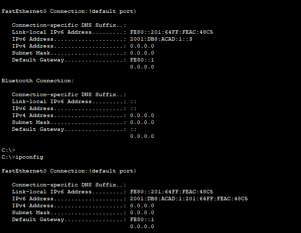
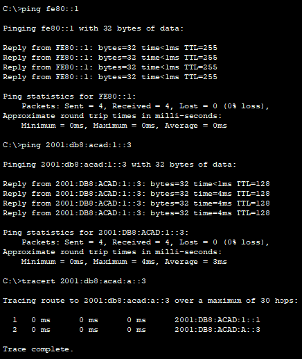
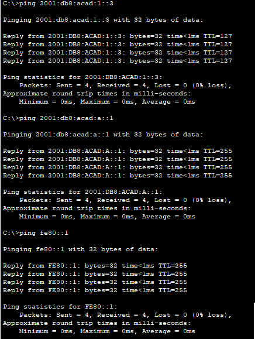

# Лабораторная работа 04. Настройка ipv6-адресов на сетевых устройствах.

#### Топология:


#### Таблица адресации:

| Устройство | Интерфейс    |IPv6-адрес    |Link local IPv6-адрес    | Длина префикса    | Шлюз по умолчанию     |
|:------------------:|:--------------:|:------:|:------:|:------:|:--------:|
R1 | G0/0/0 G0/0/1 | 2001:db8:acad:a::1 2001:db8:acad:1::1 |fe80::1<br> fe80::1 | 64<br>64| -| 
S1  |VLAN 1|2001:db8:acad:1::b|fe80::b|64|-|
PC-A|NIC|2001:db8:acad:1::3|SLACC|64|fe80::1|
PC-B|NIC|2001:db8:acad:a::3|SLACC|64|fe80::1|
 
 _<p style="margin-top: -20px;"><small style="font-size: 10px;">SLAAC (Stateless Address Autoconfiguration) в IPv6 — это механизм, который позволяет устройствам автоматически получать свой IPv6-адрес без использования DHCP-сервера.</small></p>_

#### **Часть 1. Настройка топологии и конфигурация основных параметров маршрутизатора и коммутатора:**<br>  Шаг 1. Настройте маршрутизатор.

*  Настройте маршрутизатор. Назначьте имя хоста и настройте основные параметры устройства:

```
enable
conf t
hostname R1
service password-endcryption
enable secret cisco
line vty 0
transport input telnet
password class
login
end
copy run start
```
*  Настройте коммутатор. Назначьте имя хоста и настройте основные параметры устройства:
```
enable 
conf t
hostname S1
service password-endcryption
enable secret cisco
line vty 0
transport input telnet
password class
login
end
```
```
conf t
sdm prefer dual-ipv4-and-ipv6 default
end
reload
```
 _**sdm prefer dual-ipv4-and-ipv6 default** шаблон SDM, который поддерживает работу как с IPv4, так и с IPv6_

#### **Часть 2. Ручная настройка IPv6-адресов**
 a.	Назначьте глобальные индивидуальные IPv6-адреса, указанные в таблице адресации обоим интерфейсам Ethernet на R1:
 ```
 conf t
 interface g 0/0/0
 ipv6 address 2001:db8:acad:a::1/64
 ipv6 address fe80::1 link-local
 exit
 interface g 0/0/1
 ipv6 address 2001:db8:acad:1::1/64
 ipv6 address fe80::1 link-local
 end
 ```
 ```
 show ipv6 interface brief
 ```
 

 - Какие группы многоадресной рассылки назначены интерфейсу G0/0/0?

```
show ipv6 interface g 0/0/0 
```



 **FF02::1 — все узлы сети.<br> 
FF02::2 — все маршрутизаторы сети.<br>FF02::1:FF00:1- называется адресом многоадресной рассылки запрошенного узла. Он используется для обнаружения соседей.**


2. Активируйте IPv6-маршрутизацию на R1.
```
conf t
ipv6 unicast-routing
```
PC-B:



_Включение маршрутизации на R1 позволяет PC-B автоматически формировать IPv6-адреса._

3. Назначьте IPv6-адреса интерфейсу управления (SVI) на S1:
```
conf t
interface vlan 1
ipv6 address 2001:db8:acad:1::b/64
ipv6 address fe80::b lin-local
no shutdown
end
copy run start
```
```
show ipv6 interface vlan 1
```


4. Назначьте компьютерам статические IPv6-адреса:
PC-A:


#### Часть 3. Проверка сквозного подключения:
С PC-A отправьте эхо-запрос на FE80::1. Это локальный адрес канала, назначенный G0/1 на R1.
Отправьте эхо-запрос на интерфейс управления S1 с PC-A.
Введите команду tracert на PC-A, чтобы проверить наличие сквозного подключения к PC-B.


С PC-B отправьте эхо-запрос на PC-A.
С PC-B отправьте эхо-запрос на локальный адрес канала G0/0/0 на R1.



1.	Почему обоим интерфейсам Ethernet на R1 можно назначить один и тот же локальный адрес канала — FE80::1?
* link-local предназначен только для использования в пределах одной физической сети (или сегмента). Эти адреса не маршрутизируются за пределы локального сегмента сети и действуют только внутри одной канальной сети. Поэтому можно назначить один и тот же локальный адрес канала для нескольких интерфейсов на одном маршрутизаторе, так как эти адреса уникальны только внутри каждого сегмента.

2.	Какой идентификатор подсети в индивидуальном IPv6-адресе 2001:db8:acad::aaaa:1234/64?
* Идентификатор подсети - 2001:db8:acad:0000 или 2001:db8:acad::/64
 aaaa:1234 - идентификатор узла 
