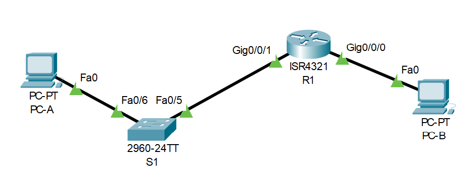

# Лабораторная работа 04. Настройка ipv6-адресов на сетевых устройствах.

#### Топология:

#### Таблица адресации:

| Устройство | Интерфейс    |IPv6-адрес    |Link local IPv6-адрес    | Длина префикса    | Шлюз по умолчанию     |
|:------------------:|:--------------:|:------:|:------:|:------:|:--------:|
R1 | G0/0/0 G0/0/1 | 2001:db8:acad:a::1 2001:db8:acad:1::1 |fe80::1  fe80::1 | 64 64| -| 
S1  |VLAN 1|2001:db8:acad:1::b|fe80::b|64|-|
PC-A|NIC|2001:db8:acad:1::3|SLACC|64|fe80::1|
PC-B|NIC|2001:db8:acad:a::3|SLACC|64|fe80::1|

