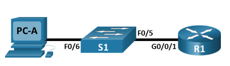
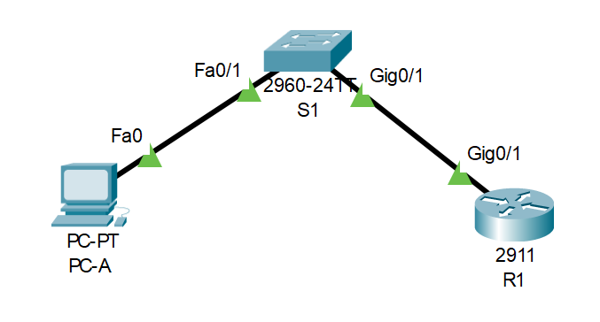
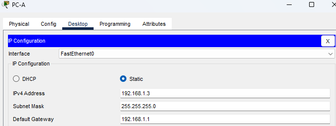
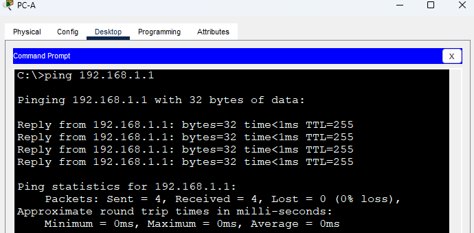
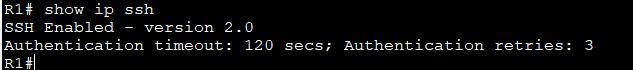
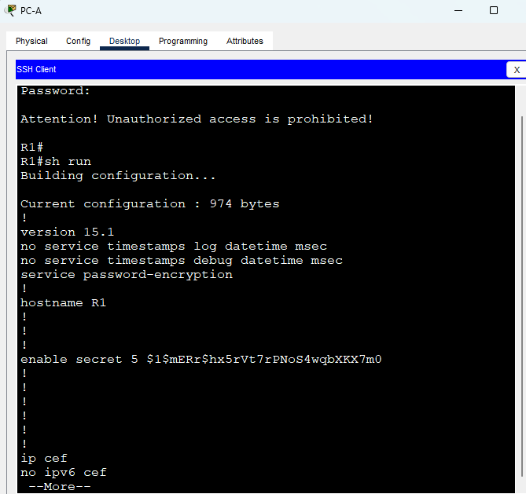
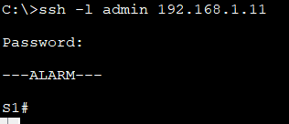

### 05 Лабораторная работа. Доступ к сетевым устройствам по протоколу SSH.

#### Топология:



#### Таблица адресации:

|Устройства|Интерфейс|IP-адрес|Маска подсети| Шлюз по умолчанию 
|:--------------:|:------------:|:-----------|:-----------:|:------------:|
|R1|G0/0/1|192.168.1.1|255.255.255.0|—|
|S1|VLAN 1|192.168.1.11|255.255.255.0|192.168.1.1|
|PC-A|NIC|192.168.1.3|255.255.255.0|192.168.1.1|


 #### **Задачи**:<br>
Часть 1. Настройка основных параметров устройства<br/>
Часть 2. Настройка маршрутизатора для доступа по протоколу SSH<br/>
Часть 3. Настройка коммутатора для доступа по протоколу SSH<br/>
Часть 4. SSH через интерфейс командной строки (CLI) коммутатора<br/>

#### **Часть 1. Настройка основных параметров устройств**

1  Создайте сеть согласно топологии.<br/>
 2 Выполните инициализацию и перезагрузку маршрутизатора и коммутатора.

 
 
 #### 3. Настройте маршрутизатор.

a.	Подключитесь к маршрутизатору с помощью консоли и активируйте привилегированный режим EXEC.<br/>
b.	Войдите в режим конфигурации.<br/>
c.	Отключите поиск DNS, чтобы предотвратить попытки маршрутизатора неверно преобразовывать введенные команды таким образом, как будто они являются именами узлов.<br/>
d.	Назначьте class в качестве зашифрованного пароля привилегированного режима EXEC.
e.	Назначьте cisco в качестве пароля консоли и включите вход в систему по паролю.


 ```
 enable
 configure terminal
 no ip domain-lookup
 enable secret class
 line console 0
password cisco
login
exit
```
f.	Назначьте cisco в качестве пароля VTY и включите вход в систему по паролю.<br/>
g.	Зашифруйте открытые пароли.<br/>
h.	Создайте баннер, который предупреждает о запрете несанкционированного доступа.


```
line vty 0 4
password cisco
login
exit

service password-encryption
banner motd "Attention! Unauthorized access is prohibited!"
```
i.	Настройте и активируйте на маршрутизаторе интерфейс G0/1, используя информацию, приведенную в таблице адресации.<br/>
j.	Сохраните текущую конфигурацию в файл загрузочной конфигурации


```
interface g0/1
ip address 192.168.1.1 255.255.255.0
no shutdown
exit
end
copy run start
 ```

 4. Настройте компьютер PC-A.



 5. Проверьте подключение к сети.
Пошлите с PC-A команду Ping на маршрутизатор R1.

 

#### **Часть 2. Настройка маршрутизатора для доступа по протоколу SSH**

 - Задайте домен для устройства:

 ```
 ip domain-name kgd.ru
 ```
 - Создайте ключ шифрования с указанием его длины:
 
 ```
crypto key generate rsa general-keys modulus 1024

 ```
 - Создайте имя пользователя в локальной базе учетных записей:

 ```
 username admssh privilege 15 secret cisco
 ```
 - Активируйте протоколы Telnet и SSH на входящих линиях VTY:

 ```
 line vty 0 4
transport input ssh telnet
login local
exit
```
- Включить SSH версии 2:
```
ip ssh version 2 
```


- Установите соединение с маршрутизатором по протоколу SSH:




#### **Часть 3. Настройка коммутатора для доступа по протоколу SSH**



- Измените способ входа в систему на проверку по локальной базе учетных записей:
```
line vty 0 4
transport input ssh telnet
login local
exit
```

#### **Часть 4. Настройка протокола SSH с использованием интерфейса командной строки (CLI) коммутатора**


