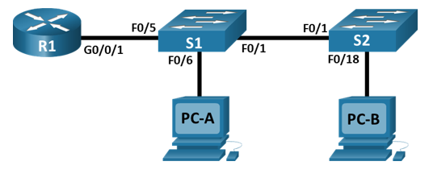
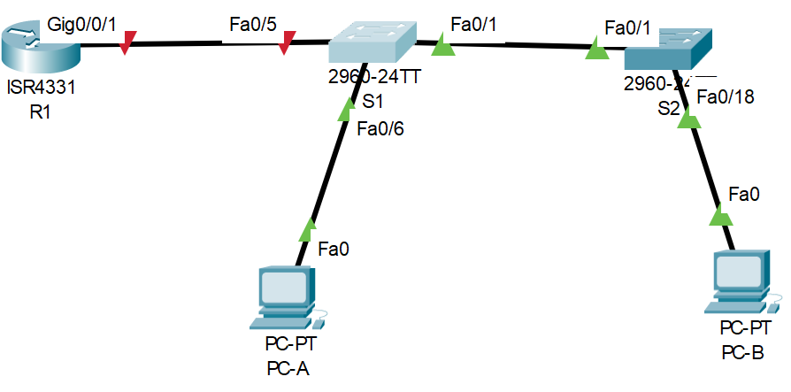

### 06 Лабораторная работа - Внедрение маршрутизации между виртуальными локальными сетями

#### Топология:


#### Таблица адресации:

|Устройства|Интерфейс|IP-адрес|Маска подсети| Шлюз по умолчанию 
|:--------------:|:------------:|:-----------|:-----------:|:------------:|
R1|G0/0/1.10<br/>G0/0/1.20<br/>G0/0/1.30<br/>G0/0/1.1000|192.168.10.1<br/>192.168.20.1<br/>192.168.30.1<br/>-------------|255.255.255.0<br/>255.255.255.0<br/>255.255.255.0<br/>--------------|-----------|
S1|VLAN10|192.168.10.11|255.255.255.0|192.168.10.1|
S2|VLAN10|192.168.10.12|255.255.255.0|192.168.10.1|
PC-A|NIC|192.168.20.3|255.255.255.0|192.168.20.1|
PC-B|NIC|192.168.30.3|255.255.255.0|192.168.30.1|

#### Таблица VLAN:
|VLAN|ИМЯ|НАЗНАЧЕННЫЙ ИНТЕРФЕЙС
|:----------------:|:----------------:|:---------------------------------------:|
10|Управление|S1:VLAN 10<br/>S2:VLAN 10|
20|Sales|S1: F0/6|
30|Operations|S2: F0/18|
999|Parking_Lot|C1: F0/2-4, F0/7-24, G0/1-2<br/>C2: F0/2-17, F0/19-24, G0/1-2|

#### Часть 1. Создание сети и настройка основных параметров устройства :

Шаг 1. Создайте сеть согласно топологии.
Подключите устройства, как показано в топологии, и подсоедините необходимые кабели:



**Шаг 2. Настройте базовые параметры для маршрутизатора и коммутаторов .**<br/>
```
enable
configure terminal
hostname R1
no ip domain-lookup
```
**Настройка паролей:**
```
conf t
enable secret class
line console 0
password cisco
login
exit
line vty 0 4
login
exit
service password-encryption
```
**Создать баннер:**
```
conf t
banner motd "---Attention---"
exit
copy run start
```
**Настроить время :**
```
clock set 22:00:00 22 oct 2024
copy run start
```

#### Часть 2. Создание сетей VLAN и назначение портов коммутатора

* Шаг 1. Создайте сети VLAN на коммутаторах:

**S1 И S2 :**
```
enable
configure terminal
vlan 10
 name Management
vlan 20
 name Sales
vlan 30
 name Operations
vlan 999
 name Parking_Lot
vlan 1000
 name Own
```
**S1 настройка ip для Vlan 10:**
```
interface vlan 10
ip address 192.168.10.11 255.255.255.0
ip default-gateway 192.168.10.1
no shutdown
exit
copy run start
``` 
**S2 настройка ip для Vlan 10:**
```
interface vlan 10
ip address 192.168.10.12 255.255.255.0
ip default-gateway 192.168.10.1
no shutdown
copy run start
```
c.	Назначьте все неиспользуемые порты коммутаторов S1 и S2 VLAN Parking_Lot,настройте их для статического режима доступа и административно деактивируйте их<br/>
**S1:**
```
interface range f0/2-4, f0/7-24, g0/1-2
sitchport mode access
switchport access vlan 999
shutdown
```
```
interface f0/6
switchport mode accesss
switchport access vlan 20
```
**S2:**
```
interface range f0/2-17, f0/19-24, f0/1-2
switchport mode access
switchport access vlan 999
shutdown
```
```
interface f0/18
switchport mode access
switchport access vlan 30
```
****


