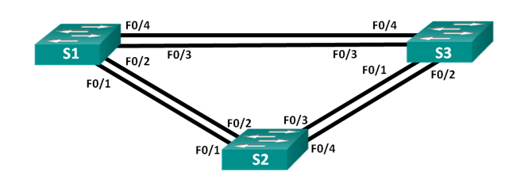

 ### Лабораторная работа. Развертывание коммутируемой сети с резервными каналами

 #### Топология :

 

Таблица адресации :

|Устройство|Интерфейс|Ip-адрес|Маска подсети|
|:------:|:-------:|:-------:|:--------:|
S1|Vlan1|192.168.1.1|255.255.255.0|
S2|Vlan1|192.168.1.2|255.255.255.0|
S3|Vlan3|192.168.1.3|255.255.255.0|

Настройте базовые параметры каждого коммутатора:

Отключить поиск DNS
```
no ip domain-lookup
```

```
enable
conf t
hostname
enable secret class

line console 0
password cisco
login
logging syncronous
exit

line vty 0 4
password cisco
login
exit

banner motd "Alarma!"
exit

copy run start
```
Назначьте IP-адрес для VLAN 1 на каждом коммутаторе:

```
interface vlan 1

ip address 192.168.1.1 255.255.255.0    *S1*

ip address 192.168.1.2 255.255.255.0    *S2*

ip address 192.168.1.3 255.255.255.0    *S3*

no shutdown
exit
copy run start
```
