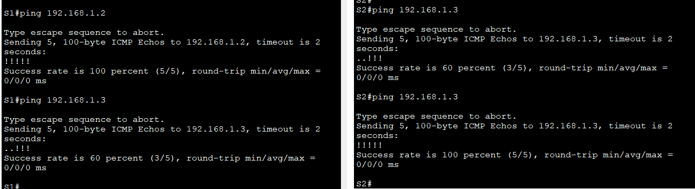
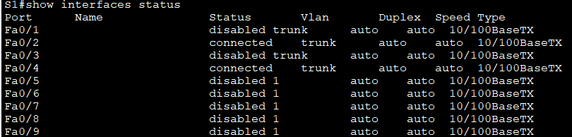
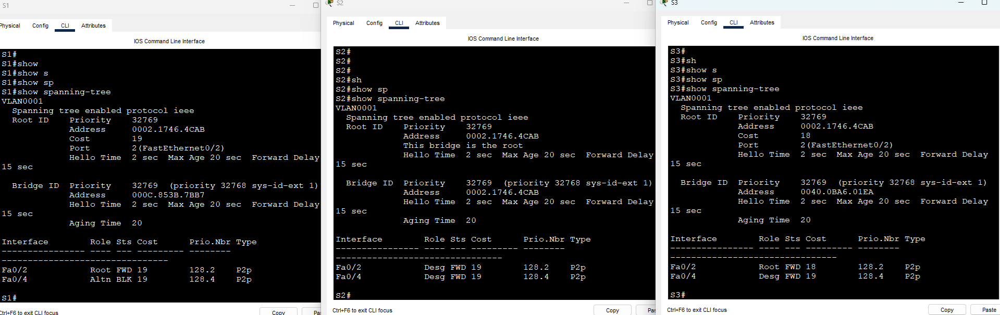
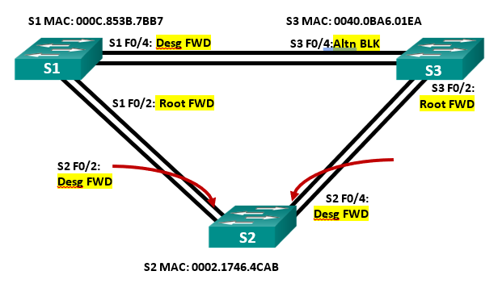

 ### Лабораторная работа. Развертывание коммутируемой сети с резервными каналами

 #### Топология :

 

Таблица адресации :

|Устройство|Интерфейс|Ip-адрес|Маска подсети|
|:------:|:-------:|:-------:|:--------:|
S1|Vlan1|192.168.1.1|255.255.255.0|
S2|Vlan1|192.168.1.2|255.255.255.0|
S3|Vlan3|192.168.1.3|255.255.255.0|

Настройте базовые параметры каждого коммутатора:

Отключить поиск DNS
```
no ip domain-lookup
```

```
enable
conf t
hostname
enable secret class

line console 0
password cisco
login
logging syncronous
exit

line vty 0 4
password cisco
login
exit

banner motd "Alarma!"
exit

copy run start
```
Назначьте IP-адрес для VLAN 1 на каждом коммутаторе:

```
interface vlan 1

ip address 192.168.1.1 255.255.255.0    # S1

ip address 192.168.1.2 255.255.255.0    # S2

ip address 192.168.1.3 255.255.255.0    # S3

no shutdown
exit
copy run start
```
Проверьте связь:




#### Часть 2:	Определение корневого моста

 1 	Отключите все порты на коммутаторах.<br/>
 ```
 conf t
 interface range f0/1-24
 shutdown
 exit
 interface g0/1-2
 shutdown
 exit
 ```
 2	Настройте подключенные порты в качестве транковых.<br/>
 ```
 conf t
 interface range f0/1-4
 switchport mode trunk
 exit

```
3	Включите порты F0/2 и F0/4 на всех коммутаторах.<br/>
```
conf t
interface f0/2
no shutdown
exit
interface f0/4
no shutdown
exit
```

 4	Отобразите данные протокола spanning-tree.<br/>

 
 
* запишите роль и состояние (Sts) активных портов на каждом коммутаторе в топологии


