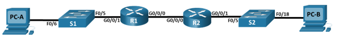
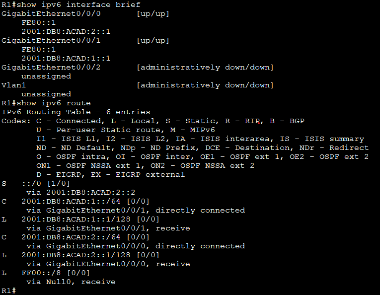
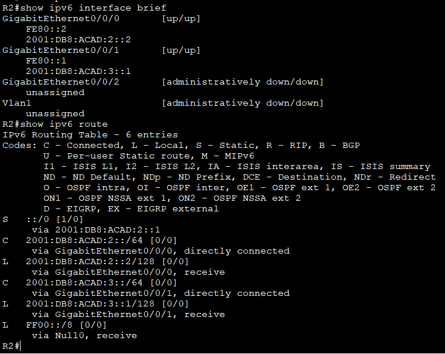
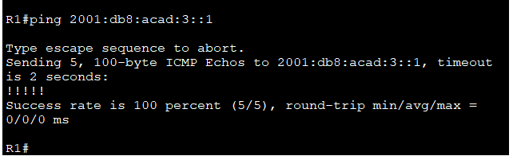
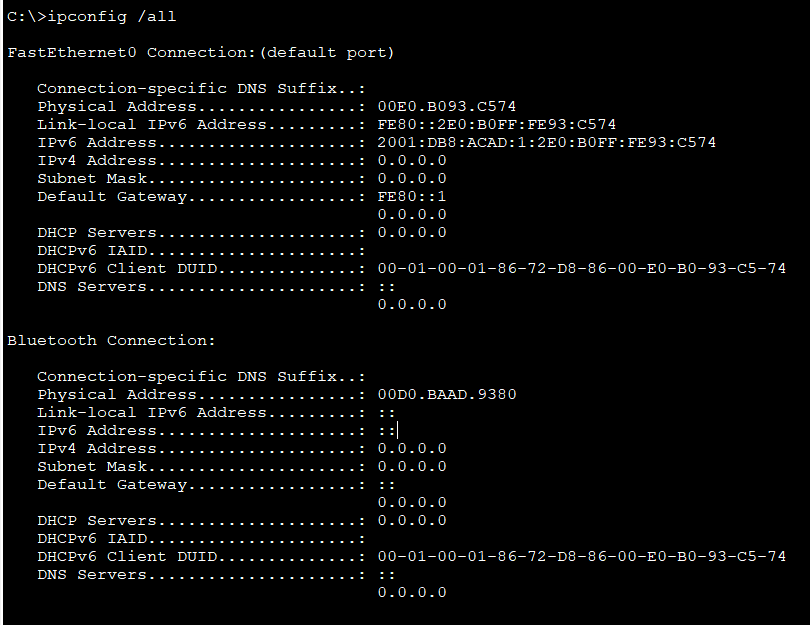

# Лабораторная работа - Настройка DHCPv6

#### Топология :


#### Таблица адресации :

|Устройство|Интерфейс|Ipv6-адрес|
|:-------:|:----------:|:-----------:|
|R1| G0/0/0|2001:db8:acad:2::1/64<br/>fe80::1|
|R1| G0/0/1|2001:db8:acad:1::1/64<br/>fe80::1|
|R2| G0/0/0|2001:db8:acad:2::2/64<br/>fe80::2|
|R2| G0/0/1|2001:db8:acad:3::1/64<br/>fe80::1|
|PC-A|NIC|DHCP|
|PC-B|NIC|DHCP|

 __Задачи__:<br/>
- Часть 1. Создание сети и настройка основных параметров устройства<br/>
- Часть 2. Проверка назначения адреса SLAAC от R1<br/>
- Часть 3. Настройка и проверка сервера DHCPv6 без гражданства на R1<br/>
- Часть 4. Настройка и проверка состояния DHCPv6 сервера на R1<br/>
- Часть 5. Настройка и проверка DHCPv6 Relay на R2<br/>

##### Часть 1:

4. Настройка интерфейсов и маршрутизации для обоих маршрутизаторов:

- a) Настройте интерфейсы G0/0/0 и G0/1 на R1 и R2 с адресами IPv6, указанными в таблице выше.
 
- **Настройка R1 :** 
```
interface g0/0/0
ipv6 address 2001:db8:acad:2::1/64
ipv6 address fe80::1 link-local
no shutdown
exit

interface g0/0/1 
ipv6 address 2001:db8:acad:1::1/64
ipv6 address fe80::1 link-local
no shutdown
exit

```
- b) Настройте маршрут по умолчанию на каждом маршрутизаторе, который указывает на IP-адрес G0/0/0 на другом маршрутизаторе

```
ipv6 route ::/0 2001:db8:acad:2::2
copy run start
```


- **Настройка R2 :**
```
interface g0/0/0
ipv6 address 2001:db8:acad:2::2/64
ipv6 address fe80::2 link-local
no shutdown
exit

interface g0/0/1
ipv6 address 2001:db8:acad:3/64
ipv6 address fe80::1 link-local
no shutdown
exit

ipv6 route ::/0 2001:db8:acad2::1
copy run start
```


#### c)	Убедитесь, что маршрутизация работает с помощью пинга адреса G0/0/1 R2 из R1:




### Часть 2. Проверка назначения адреса SLAAC от R1



- Откуда взялась часть адреса с идентификатором хоста?

Идентификатор хоста 2E0:B0FF:FE93:C574 получился из мас-адреса 00E0.B093.C574

-мас-адрес 00E0.B093.C574 делиться на две части по 24 бита и между этими частями добавляется
 FFFE 

- 00E0BO**FFFE**93C574

-Седьмой бит адреса меняется на противоположный (1-на 0, 0- на еденицу)

- первый байт 00=000000**0**0- меняем 7 бит на **1** получится 00000010=02 **2E0:B0FF:FE93:C574**


