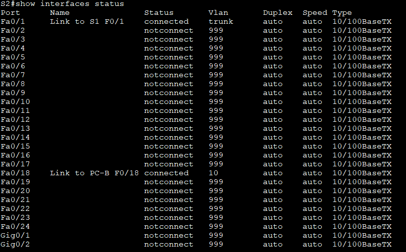

# Лабораторная работа-Конфигурация безопасности коммутатора

Топология:


Таблица адресации

|Устройство| interface/vlan | ip-адрес | Маска подсети |
|:------:|:------:|:--------:|:---------:|
|R1| G0/0/1<br>Loopback 0| 192.168.10.1<br>10.10.1.1|255.255.255.0<br>255.255.255.0|
|S1|VLAN 10| 192.168.10.201| 255.255.255.0|
|S2|VLAN 10| 192.168.10.202| 255.255.255.0|
|PC-A|NIC|DHCP|255.255.255.0|
|PC-B|NIC|DHCP|255.255.255.0|

#### Часть 1. Настройка основного сетевого устройства
R1:
```
enable
configure terminal
hostname R1
no ip domain lookup
ip dhcp excluded-address 192.168.10.1 192.168.10.9
ip dhcp excluded-address 192.168.10.201 192.168.10.202
!
ip dhcp pool Students
 network 192.168.10.0 255.255.255.0
 default-router 192.168.10.1
 domain-name CCNA2.Lab-11.6.1
!
interface Loopback0
 ip address 10.10.1.1 255.255.255.0
!
interface GigabitEthernet0/0/1
 description Link to S1
 ip dhcp relay information trust-all
 ip address 192.168.10.1 255.255.255.0
 no shutdown
!
line con 0
 logging synchronous
 exec-timeout 0 0

```
b.	Проверьте текущую конфигурацию на R1


-  Настройка и проверка основных параметров коммутатора
S1:
```
enable
conf t
interface f0/5
description Link R1 G0/0/1

interface f0/6
description Link PC-A

interface F0/1
description Link S2 F0/1

```
S2
```
interface f0/1
description Link S1 F0/1

interface F0/18
description Link PC-B

```
Установите для шлюза по умолчанию для VLAN управления значение 192.168.10.1 на обоих коммутаторах.
```
conf t
ip default-gateway 192.168.10.1
```

#### Часть 2. Настройка сетей VLAN на коммутаторах.

- a. Сконфигруриуйте VLAN 10.
Добавьте VLAN 10 на S1 и S2 и назовите VLAN - Management.

 ```
 conf t
 vlan 10
 name MNG
 ```   
- Настройте IP-адрес в соответствии с таблицей адресации для SVI для VLAN 10 на S1 и S2. Включите интерфейсы SVI и предоставьте описание для интерфейса.

S1:
```
conf t
interface vlan 10
ip address 192.168.10.201 255.255.255.0
description S1 MNG VLAN
```
S2:
```
conf t
interface vlan 10
ip address 192.168.10.202 255.255.255.0
description S2 MNG VLAN
```
- Настройте VLAN 333 с именем Native на S1 и S2.
- Настройте VLAN 999 с именем ParkingLot на S1 и S2.
```
conf t
vlan 333
name native
vlan 999
name Parking_lot
```
#### Часть 3. Настройки безопасности коммутатора.

- Настройте все магистральные порты Fa0/1 на обоих коммутаторах для использования VLAN 333 в качестве native VLAN.

```
conf t
interface f0/1
switchport mode trunk
switchport trunk native vlan 333
```


- Отключить согласование DTP F0/1 на S1 и S2.
```
conf t
interface f0/1
switchport nonegotiate
```
\

- На S1 настройте F0/5 и F0/6 в качестве портов доступа и свяжите их с VLAN 10.

```
conf t
interface range f0/5-6
switchport mode access

```
- На S2 настройте порт доступа Fa0/18 и свяжите его с VLAN 10.
```
conf t
interface f0/18
switchport mode access
switchport access vlan 10
```
- На S1 и S2 переместите неиспользуемые порты из VLAN 1 в VLAN 999 и отключите неиспользуемые порты.

```
conf t
interface range f0/2-4, f0/7-24, g0/1-2
switchport mode access
switchport access vlan 999
shutdown 
```




Интерфейсы F0/6 на S1 и F0/18 на S2 настроены как порты доступа. На этом шаге вы также настроите безопасность портов на этих двух портах доступа.
- На S1, введите команду show port-security interface f0/6  для отображения настроек по умолчанию безопасности порта для интерфейса F0/6


Конфигурация безопасности порта по умолчанию


|Функция|Настройка по умолчанию|
|:---------------:|:---------------:|
|Защита портов| Disabled            |
|Максимальное количество записей MAC-адресов| 1               |
|Режим проверки на нарушение безопасности| Shutdown            |
|Aging Time|   0 mins               |
|Aging Type| Absolute                  |
|Secure Static Address Aging|      Disabled        |
|Sticky MAC Address| 0          |


 - На S1 включите защиту порта на F0 / 6 со следующими настройками:<br>
o	Максимальное количество записей MAC-адресов: 3<br/>
o	Режим безопасности: restrict<br/>
o	Aging time: 60 мин.<br/>
o	Aging type: неактивный<br/>

 ```
 conf t
 interface f0/6
 switchport port-security maximum 3

 switchport port-security aging time 60
 ```
 

 -	Включите безопасность порта для F0 / 18 на S2. Настройте каждый активный порт доступа таким образом, чтобы он автоматически добавлял адреса МАС, изученные на этом порту, в текущую конфигурацию.<br/>
	Настройте следующие параметры безопасности порта на S2 F / 18:<br/>
o	Максимальное количество записей MAC-адресов: 2<br/>
o	Тип безопасности: Protect<br/>
o	Aging time: 60 мин.<br/>

```
conf t
interface f0/18
switchport port-security
switchport port-security mac-address sticky

switchport port-security maximum 2

switchport  port-security violation protect

switchport port-security  aging time 60

```


##### Реализовать безопасность DHCP snooping.
- На S2 включите DHCP snooping и настройте DHCP snooping во VLAN 10.
```
conf t
ip dhcp snooping
ip dhcp snooping vlan 10
```
- Настройте магистральные порты на S2 как доверенные порты
```
interface f0/1
ip dhcp snooping trust
```
 - Ограничьте ненадежный порт Fa0/18 на S2 пятью DHCP-пакетами в секунду
 ```
 conf t
 interface f0/18
 ip dhcp snooping limit rate 5
```


-В командной строке на PC-B освободите, а затем обновите IP-адрес


- Проверьте привязку отслеживания DHCP с помощью команды show ip dhcp snooping binding.


##### Реализация PortFast и BPDU Guard
- Настройте PortFast на всех портах доступа, которые используются на обоих коммутаторах<br/>

S1:
```
conf t
interface range f0/5-6
spanning-tree portfast
```
S2:
```
conf t
interface f0/18
spanning-tree portfast
```
- Включите защиту BPDU на портах доступа VLAN 10 S1 и S2, подключенных к PC-A и PC-B.

S1:
```
interface f0/6
spanning-tree bpduguard enable
```
S2:
```
interface f0/18
spanning-tree bpduguard enable
```
ping R1 , PC-B

