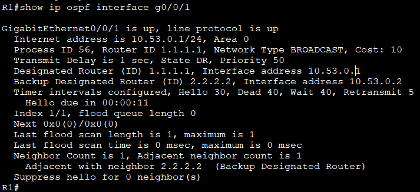
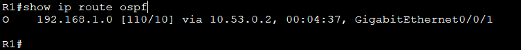
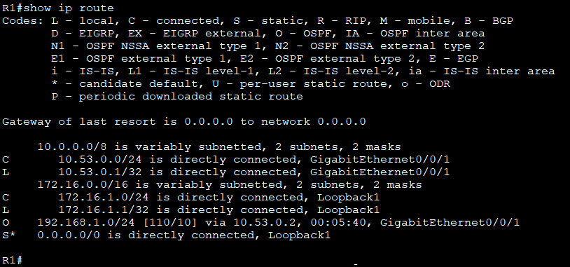
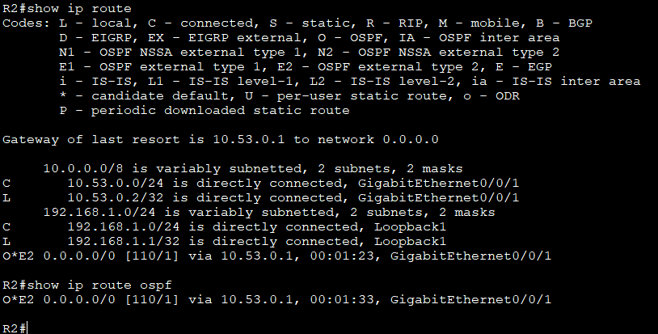

# Лабораторная работа. Настройка протокола OSPFv2 для одной области

Топология:


Таблица адресации:

|Устройство|Интерфейс|Ip-адрес|Маска подсети|
|:--------:|:---------:|:---------:|:---------:|
|R1| G0/0/1<br/>Loopback1|10.53.0.1<br/>172.16.1.1|255.255.255.0<br/>255.255.255.0|
|R2|G0/0/1<br/>Loopback1|10.53.0.2<br/>192.168.1.1|255.255.255.0<br/>255.255.255.0|

Цели:<br>
 Часть 1. Создание сети и настройка основных параметров устройства<br/>
 Часть 2. Настройка и проверка базовой работы протокола  OSPFv2 для одной области<br/>
 Часть 3. Оптимизация и проверка конфигурации OSPFv2 для одной области


## Часть 1. Создание сети и настройка основных параметров устройства

Базовая настройка маршрутизаторов:

```
enable
conf t
hostname R1
no ip domain-lookup
enable secret class
line console 0
password cisco
login
exit

line vty 0 4
password cisco
login
exit

service password-encryption
banner motd "Alarm!"
end
copy run start
```

### Часть 2: Настройка и проверка базовой работы OSPFv2

1. Настройка адресов интерфейсов

- R1
```
enable
conf t
interface g0/0/1
ip address 10.53.0.1 255.255.255.0
no shutdown
exit

interface loopback1
ip address 172.16.1.1 255.255.255.0
exit
```

- R2

```
enable
conf t
interface g0/0/1
ip address 10.53.0.2 255.255.255.0
no shutdown
exit

interface loopback1
ip address 192.168.1.1 255.255.255.0
exit
```
-Перейдите в режим конфигурации маршрутизатора OSPF, используя идентификатор процесса 56.<br/>
-Настройте статический идентификатор маршрутизатора для каждого маршрутизатора (1.1.1.1 для R1, 2.2.2.2 для R2).<br/>
-Настройте инструкцию сети для сети между R1 и R2, поместив ее в область 0.<br/>
-Только на R2 добавьте конфигурацию, необходимую для объявления сети Loopback 1 в область OSPF 0.

- R1
```
conf t
router ospf 56
router-id 1.1.1.1
network 10.53.0.0 0.0.0.255 area 0
network 172.16.1.0 0.0.0.255 area 0
end
```
- R2
```
conf t
router ospf 56
router-id 2.2.2.2
network 10.53.0.0 0.0.0.255 area 0
network 192.168.1.0 0.0.0.255 area 0
end
```

-Убедитесь, что OSPFv2 работает между маршрутизаторами. Выполните команду, чтобы убедиться, что R1 и R2 сформировали смежность.<br/>


Вопрос:
Какой маршрутизатор является DR? Какой маршрутизатор является BDR? Каковы критерии отбора?
DR: Маршрутизатор с самым высоким приоритетом интерфейса OSPF. **R2** - DR
BDR: Маршрутизатор со вторым самым высоким приоритетом интерфейса OSPF. **R1** - BDR

Выбор DR и BDR основан на приоритете интерфейса OSPF (priority)- если  не задано, то используется значение по умолчанию 1.<br/>
Идентификатор маршрутизатора (Router ID)- если приоритеты  одинаковые, то используется самый высокий Router ID<br/>
R1: router-id 1.1.1.1 меньше R2:router-id 2.2.2.2 = R2-DR   R1- BDR  


-R1 выполните команду show ip route ospf, чтобы убедиться, что сеть R2 Loopback1 присутствует в таблице маршрутизации. Обратите внимание, что поведение OSPF по умолчанию заключается в объявлении интерфейса обратной связи в качестве маршрута узла с использованием 32-битной маски.<br/>


-Запустите Ping до  адреса интерфейса R2 Loopback 1 из R1. Выполнение команды ping должно быть успешным.


#### Часть 3. Оптимизация и проверка конфигурации OSPFv2 для одной области

-На R1 настройте приоритет OSPF интерфейса G0/0/1 на 50, чтобы убедиться, что R1 является назначенным маршрутизатором

```
conf t
interface g0/0/1
ip ospf priority 50
end
copy run start
```
-Настройте таймеры OSPF на G0/0/1 каждого маршрутизатора для таймера приветствия, составляющего 30 секунд.

```
conf t
interface g0/0/1
ip ospf hello-interval 30
```

-На R1 настройте статический маршрут по умолчанию, который использует интерфейс Loopback 1 в качестве интерфейса выхода. 
Затем распространите маршрут по умолчанию в OSPF.<br/>
Добавьте конфигурацию, необходимую для OSPF для обработки R2 Loopback 1 как сети точка-точка
```
conf t
interface loopback 1
ip address 172.16.1.1 255.255.255.0
exit

ip route 0.0.0.0 0.0.0.0 loopback 1

router ospf 56
default-information originate
```

-Только на R2 добавьте конфигурацию, необходимую для предотвращения отправки объявлений OSPF в сеть Loopback 1.
```
conf t
router ospf 56
passive-interface Loopback 1
interface loopback 1
ip ospf network point-to-point
```
-Измените базовую пропускную способность для маршрутизаторов. После этой настройки перезапустите OSPF с помощью команды clear ip ospf process 
```
conf t
interface g0/0/1
bandwidth 1000

clear ip ospf process
```
2. Убедитесь, что оптимизация OSPFv2 реализовалась

```
show ip ospf interface g0/0/1
```


На R1 выполните команду show ip route ospf, чтобы убедиться, что сеть R2 Loopback1 присутствует в таблице маршрутизации



-Запустите Ping до адреса интерфейса R1 Loopback 1 из R2. Выполнение команды ping должно быть успешным.



  
R2:
```
show ip route ospf
```
