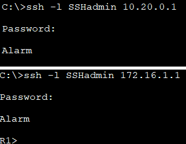

# Лабораторная работа. Настройка и проверка расширенных списков контроля доступа.

__Топология__


__Таблица адресации__
|Устройства|Интерфейс|IP-адрес|Маска подсети|Шлюз по умолчанию|
|:-------:|:--------:|:------:|:------:|:---------:|
|R1|G0/0/1<br/>G0/0/1.20<br/>G0/0/1.40<br/>G0/0/1.1000<br/>Loopback1|---<br/>10.20.0.1<br/>10.30.0.1<br/>10.40.0.1<br/>---|---<br/>255.255.255.0<br/>255.255.255.0<br/>255.255.255.0<br/>---|---|
|R2|G0/0/1|10.20.0.4|255.255.255.0|---|
|S1|VLAN 20|10.20.0.4|255.255.255.0|10.20.0.1|
|S2|VLAN 20|10.20.0.3|255.255.255.0|10.20.0.1|
|PC-A|NIC|10.30.0.10|255.255.255.0|10.30.0.1|
|PC-B|NIC|10.40.0.10|255.255.255.0|10.40.0.1|

__Таблица VLAN__
|VLAN|Имя|Назначенный интерфейс|
|:------:|:-----:|:----------------------------------------------:
|20|Management|S2: F0/5|
|30|Operations|S1: F0/6|
|40|Sales|S2: F0/18|
|999|ParkingLot|S1: F0/2-4, F0/7-24, G0/1-2<br/>S2: F0/2-4, F0/6-17, F0/19-24, G0/1-2|
|1000|Native|---|

## Часть 1. Создание сети и настройка основных параметров устройства:

- Произведите базовую настройку маршрутизаторов и коммутаторов.

```
conf t
hostname R1
no ip domain-lookup
enable secret class
line console 0
password cisco
login

line vty 0 4 
password cisco
login

service password-encryption

banner motd "Alarm!"

copy run start

```
### Часть 2. Настройка сетей VLAN на коммутаторах.

- Создайте необходимые VLAN и назовите их на каждом коммутаторе из приведенной выше таблицы
```
conf t
vlan 20
name Management

vlan 30
name Operations

vlan 40
name Sales

vlan 999
name ParkingLot

vlan 1000
name Native
```
 - Настройте интерфейс управления и шлюз по умолчанию на каждом коммутаторе, используя информацию об IP-адресе в таблице адресации.

 S1:
 ```
 conf t
 interface vlan 20
 ip address 10.20.0.2 255.255.255.0
 exit

 ip default-gateway 10.20.0.1

```
S2:
```
conf t
interface vlan 20
ip address 10.20.0.3 255.255.255.0
exit

ip default-gateway 10.20.0.1
```
 - Назначьте все неиспользуемые порты коммутатора VLAN Parking Lot, настройте их для статического режима доступа и административно деактивируйте их.

S1:
 ```
 conf t
 interface range fa0/2-4, fa0/7-24, g0/1-2
 switchport mode access
 switchport access vlan 999
 shutdown
 ```
 S2:
 ```
 conf t
 interface range fa0/2-4, fa0/6-17, fa0/19-24, g0/1-2
 switchport mode access
 switchport access vlan 999
 shutdown
 ```
-Назначьте используемые порты соответствующей VLAN (указанной в таблице VLAN выше) и настройте их для режима статического доступа.

S1:
```
conf t
interface fa0/6
switchport mode access
switchport access vlan 30
```
S2:
```
conf t
interface fa0/5
switchport mode access
switchport access vlan 20

interface fa0/18
switchport mode access
switchport access vlan 40
```


#### Часть 3. Настройте транки (магистральные каналы).

 - Измените режим порта коммутатора на интерфейсе F0/1, чтобы принудительно создать магистральную связь. Не забудьте сделать это на обоих коммутаторах.


```
conf t
interface fa0/1
switchport mode trunk
```
 - В рамках конфигурации транка установите для native vlan значение 1000 на обоих коммутаторах. При настройке двух интерфейсов для разных собственных VLAN сообщения об ошибках могут отображаться временно.

```
switchport trunk native vlan 1000
```
- В качестве другой части конфигурации транка укажите, что VLAN 10, 20, 30 и 1000 разрешены в транке.
```
switchport trunk allowed vlan 20,30,40,1000
```


- Настройте интерфейс S1 F0/5 с теми же параметрами транка, что и F0/1. Это транк до маршрутизатора.
```
conf t
interface fa0/5
switchport mode trunk
switchport trunk native vlan 1000
switchport trunk allowed 20,30,40,1000

copy run start
```

##### Часть 4. Настройте маршрутизацию.

 - Активируйте интерфейс G0/0/1 на маршрутизаторе.
 ```
 conf t 
 interface g0/0/1
 no shutdown
 ```

 - Настройте подинтерфейсы для каждой VLAN, как указано в таблице IP-адресации. Все подинтерфейсы используют инкапсуляцию 802.1Q. Убедитесь, что подинтерфейс для собственной VLAN не имеет назначенного IP-адреса. Включите описание для каждого подинтерфейса.
 ```
 conf t
 interface g0/0/1.20
 ip address 10.20.0.1 255.255.255.0
 encapsulation dot1q 20
 description MANAGEMENT VLAN
 exit

 interface g0/0/1.30
 ip address 10.30.0.1 255.255.255.0
 encapsulation dot1q 30
 description OPERATIONS VLAN
 exit

 interface g0/0/1.40
 ip address 10.40.0.1 255.255.255.0
 encapsulation dot1q 40
 description SALES VLAN
 exit

 interface g0/0/1.1000
 description NATIVE VLAN
encapsulation  dot1q 1000 native
exit

interface Loopback 1 
ip address 172.16.1.1 255.255.255.0
```


 - Настройка интерфейса R2 g0/0/1 с использованием адреса из таблицы и маршрута по умолчанию с адресом следующего перехода 10.20.0.1

```
conf t
interface g0/0/1
ip address 10.20.0.4 255.255.255.0
no shutdown
exit

ip route 0.0.0.0 0.0.0.0 10.20.0.1
```
###### Часть 5. Настройте удаленный доступ

 - Создайте локального пользователя с именем пользователя SSHadmin и зашифрованным паролем $cisco123!
R1 S1 S2 R2:
```
conf t
username SSHadmin secret $cisco123!
ip domain-name ccna-lab.com
```
- Генерируйте криптоключи с помощью 1024 битного модуля
```
conf t
crypto key generate rsa general-keys modulus 1024
ip ssh version 2
```
- Настройте первые пять линий VTY на каждом устройстве, чтобы поддерживать только SSH-соединения и с локальной аутентификацией.

```
conf t
transport input ssh 
login local
```

- Включите сервер HTTPS на R1.
```
conf t
ip http secure-server 
```

# Часть 6. Проверка подключения


- Выполните следующие тесты. Эхозапрос должен пройти успешно


PC-A:


PC-B:




## Часть 7. Настройка и проверка списков контроля доступа (ACL)

- Политика1. Сеть Sales не может использовать SSH в сети Management (но в  другие сети SSH разрешен).


- Политика 2. Сеть Sales не имеет доступа к IP-адресам в сети Management с помощью любого веб-протокола (HTTP/HTTPS). Сеть Sales также не имеет доступа к интерфейсам R1 с помощью любого веб-протокола. Разрешён весь другой веб-трафик


- Политика3. Сеть Sales не может отправлять эхо-запросы ICMP в сети Operations или Management. Разрешены эхо-запросы ICMP к другим адресатам. 

```
conf t
access-list 100 deny tcp 10.40.0.0 0.0.0.255 10.20.0.0 0.0.0.255 eq 22

access-list 100 deny tcp 10.40.0.0 0.0.0.255 10.20.0.0 0.0.0.255 eq 80
access-list 100 deny tcp 10.40.0.0 0.0.0.255 10.20.0.0 0.0.0.255 eq 443

access-list 100 deny tcp 10.40.0.0 0.0.0.255 host 10.20.0.1 eq 80
access-list 100 deny tcp 10.40.0.0 0.0.0.255 host 10.20.0.1 eq 443

access-list 100 deny tcp 10.40.0.0 0.0.0.255 host 10.30.0.1 eq 80
access-list 100 deny tcp 10.40.0.0 0.0.0.255 host 10.30.0.1 eq 443

access-list 100 deny tcp 10.40.0.0 0.0.0.255 host 10.40.0.1 eq 80
access-list 100 deny tcp 10.40.0.0 0.0.0.255 host 10.40.0.1 eq 443

access-list 100 deny icmp 10.40.0.0 0.0.0.255 10.20.0.0 0.0.255.255 echo
access-list 100 deny icmp 10.40.0.0 0.0.0.255 10.30.0.0 0.0.255.255 echo
access-list 100 permit ip any any
interface g0/0/1.40
ip access-group 100 in
```

- Политика 4: Cеть Operations  не может отправлять ICMP эхозапросы в сеть Sales. Разрешены эхо-запросы ICMP к другим адресатам. 
```
access-list 110 deny icmp 10.30.0.0 0.0.0.255 10.40.0.0 0.0.0.255 echo
access-list 110 permit ip any any
interface g0/0/1.30
ip access-group 110 in
```
Выполните следующие тесты. Ожидаемые результаты показаны в таблице:


PC-A ping :


PC-B ping :


PC-B ssh :

