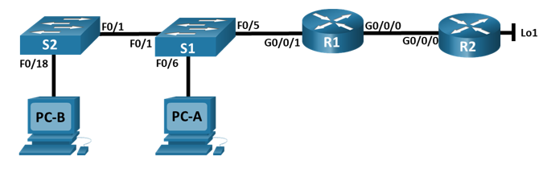

# Лабораторная работа - Настройка NAT для IPv4

Топология:



Таблица адресации:

|Устройство|Интерфейс|IP-адрес|Маска подсети|
|:------------:|:------------:|:------------:|:----------:|
|R1|G0/0/0<br/>G0/0/1|209.165.200.230<br/>192.168.1.1|255.255.255.248<br/>255.255.255.0|
|R2|G0/0/0<br/>Lo1|209.165.200.225<br/>209.165.200.1|255.255.255.248<br/>255.255.255.224|
|S1|VLAN 1|192.168.1.11|255.255.255.0|
|S2|VLAN 1|192.168.1.12|255.255.255.0|
|PC-A|NIC|192.168.1.2|255.255.255.0|
|PC-B|NIC|192.168.1.3|255.255.255.0|

Цели: <br/>
Часть 1. Создание сети и настройка основных параметров устройства<br/>
Часть 2. Настройка и проверка NAT для IPv4<br/>
Часть 3. Настройка и проверка PAT для IPv4<br/>
Часть 4. Настройка и проверка статического NAT для IPv4.<br/>

## Часть 1. Создание сети и настройка основных параметров устройства

 - Произведите базовую настройку маршрутизаторов:<br/>

R1 :
 ```
 enable
 conf t
 hostname R1
 no ip domain-lookup
 enable secret class
 
 line console 0
 password cisco
 login
 exit

 line vty 0 4
 password cisco
 login
 exit

service password-encryption

banner motd "Alarm!"

interface g0/0/0
ip address 209.165.200.230 255.255.255.248
no shutdown

interface g0/0/1
ip address 192.168.1.1 255.255.255.0
no shutdown
exit

ip route 0.0.0.0 0.0.0.0 209.165.200.225

copy run start
 ```
 R2:

 ```
interface g0/0/0
ip address 209.165.200.225 255.255.255.248
no shutdown

interface loopback 1
ip address 209.165.200.1 255.255.255.224
no shutdown
end

copy run start

```

- Настройте базовые параметры каждого коммутатора.


S1
```
interface range f0/2-4, f0/7-24, g0/1-2
shutdown

interface vlan 1
ip address 192.168.1.11 255.255.255.0
no shutdown
exit
ip default-gateway 192.168.1.1

copy run start

```

S2 :

```
interface range f0/2-17, f0/19-24, g0/1-2
shutdown

interface vlan 1
ip address 192.168.1.12 255.255.255.0
no shutdown
exit
ip default-gateway 192.168.1.1
end

copy run start

```
### Часть 2. Настройка и проверка NAT для IPv4

- Настройте NAT на R1, используя пул из трех адресов 209.165.200.226-209.165.200.228

a.	Настройте простой список доступа, который определяет, какие хосты будут разрешены для трансляции. В этом случае все устройства в локальной сети R1 имеют право на трансляцию

```
access-list 1 permit 192.168.1.0 0.0.0.255 
```
b.	Создайте пул NAT и укажите ему имя и диапазон используемых адресов.
```
ip nat pool PUBLIC_ACCESS 209.165.200.226 209.165.200.228 netmask 255.255.255.248 
```
- Примечание. Параметр маски сети не является разделителем IP-адресов. Это должна быть правильная маска подсети для назначенных адресов, даже если вы используете не все адреса подсети в пуле. 

c.	Настройте перевод, связывая ACL и пул с процессом преобразования
```
ip nat inside source list 1 pool PUBLIC_ACCESS

```
- Примечание: Три очень важных момента. Во-первых, слово «inside» имеет решающее значение для работы такого рода NAT. Если вы опустить его, NAT не будет работать. Во-вторых, номер списка — это номер ACL, настроенный на предыдущем шаге. В-третьих, имя пула чувствительно к регистру. 

d.	Задайте внутренний (inside) интерфейс. 

```
interface g0/0/1
ip nat inside
```
e.	Определите внешний (outside) интерфейс.

```
interface g0/0/0
ip nat outside
```

