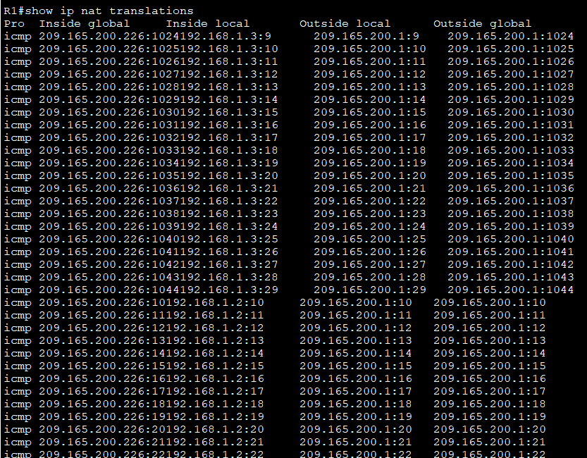
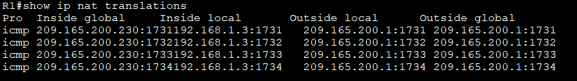
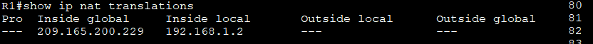
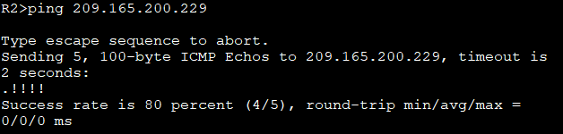
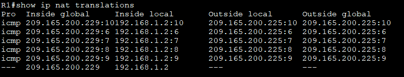

# Лабораторная работа - Настройка NAT для IPv4

Топология:


Таблица адресации:

|Устройство|Интерфейс|IP-адрес|Маска подсети|
|:------------:|:------------:|:------------:|:----------:|
|R1|G0/0/0<br/>G0/0/1|209.165.200.230<br/>192.168.1.1|255.255.255.248<br/>255.255.255.0|
|R2|G0/0/0<br/>Lo1|209.165.200.225<br/>209.165.200.1|255.255.255.248<br/>255.255.255.224|
|S1|VLAN 1|192.168.1.11|255.255.255.0|
|S2|VLAN 1|192.168.1.12|255.255.255.0|
|PC-A|NIC|192.168.1.2|255.255.255.0|
|PC-B|NIC|192.168.1.3|255.255.255.0|

Цели: <br/>
Часть 1. Создание сети и настройка основных параметров устройства<br/>
Часть 2. Настройка и проверка NAT для IPv4<br/>
Часть 3. Настройка и проверка PAT для IPv4<br/>
Часть 4. Настройка и проверка статического NAT для IPv4.<br/>

## Часть 1. Создание сети и настройка основных параметров устройства

 - Произведите базовую настройку маршрутизаторов:<br/>

R1 :
 ```
 enable
 conf t
 hostname R1
 no ip domain-lookup
 enable secret class
 
 line console 0
 password cisco
 login
 exit

 line vty 0 4
 password cisco
 login
 exit

service password-encryption

banner motd "Alarm!"

interface g0/0/0
ip address 209.165.200.230 255.255.255.248
no shutdown

interface g0/0/1
ip address 192.168.1.1 255.255.255.0
no shutdown
exit

ip route 0.0.0.0 0.0.0.0 209.165.200.225

copy run start
 ```
 R2:

 ```
interface g0/0/0
ip address 209.165.200.225 255.255.255.248
no shutdown

interface loopback 1
ip address 209.165.200.1 255.255.255.224
no shutdown
end

copy run start

```

- Настройте базовые параметры каждого коммутатора.


S1
```
interface range f0/2-4, f0/7-24, g0/1-2
shutdown

interface vlan 1
ip address 192.168.1.11 255.255.255.0
no shutdown
exit
ip default-gateway 192.168.1.1

copy run start

```

S2 :

```
interface range f0/2-17, f0/19-24, g0/1-2
shutdown

interface vlan 1
ip address 192.168.1.12 255.255.255.0
no shutdown
exit
ip default-gateway 192.168.1.1
end

copy run start

```
### Часть 2. Настройка и проверка NAT для IPv4

- Настройте NAT на R1, используя пул из трех адресов 209.165.200.226-209.165.200.228

a.	Настройте простой список доступа, который определяет, какие хосты будут разрешены для трансляции. В этом случае все устройства в локальной сети R1 имеют право на трансляцию

```
access-list 1 permit 192.168.1.0 0.0.0.255 
```
b.	Создайте пул NAT и укажите ему имя и диапазон используемых адресов.
```
ip nat pool PUBLIC_ACCESS 209.165.200.226 209.165.200.228 netmask 255.255.255.248 
```
- Примечание. Параметр маски сети не является разделителем IP-адресов. Это должна быть правильная маска подсети для назначенных адресов, даже если вы используете не все адреса подсети в пуле. 

c.	Настройте перевод, связывая ACL и пул с процессом преобразования
```
ip nat inside source list 1 pool PUBLIC_ACCESS

```
- Примечание: Три очень важных момента. Во-первых, слово «inside» имеет решающее значение для работы такого рода NAT. Если вы опустить его, NAT не будет работать. Во-вторых, номер списка — это номер ACL, настроенный на предыдущем шаге. В-третьих, имя пула чувствительно к регистру. 

d.	Задайте внутренний (inside) интерфейс. 

```
interface g0/0/1
ip nat inside
```
e.	Определите внешний (outside) интерфейс.

```
interface g0/0/0
ip nat outside
```
 -  Проверьте и проверьте конфигурацию

a.	С PC-B,  запустите эхо-запрос интерфейса Lo1 (209.165.200.1) на R2. Если эхо-запрос не прошел, выполните процес поиска и устранения неполадок. На R1 отобразите таблицу NAT на R1 с помощью команды:

```
show ip nat translations
```


- Во что был транслирован внутренний локальный адрес PC-B?

__209.165.200.226__

- Какой тип адреса NAT является переведенным адресом?

__Inside global__

 b.	С PC-A, запустите  эхо-запрос интерфейса Lo1 (209.165.200.1) на R2

 

 c. Из S1, эхо-запрос интерфейса Lo1 (209.165.200.1) на R2

 

 - пинг R2 Lo1 из S2. На этот раз перевод завершается неудачей,
 это ожидаемый результат, потому что выделено только 3 адреса.

 #### Часть 3. Настройка и проверка PAT для IPv4.

 - необходимо настроить замену NAT на PAT в пул адресов, а затем на PAT с помощью интерфейса.

 Компоненты конфигурации преобразования адресов в основном одинаковы; что-то (список доступа) для идентификации адресов, пригодных для перевода, дополнительно настроенный пул адресов для их преобразования и команды, необходимые для идентификации внутреннего и внешнего интерфейсов. Из части 1 наш список доступа (список доступа 1) по-прежнему корректен для сетевого сценария, поэтому нет необходимости воссоздавать его. Мы будем использовать один и тот же пул адресов, поэтому нет необходимости воссоздавать эту конфигурацию. Кроме того, внутренний и внешний интерфейсы не меняются. Чтобы начать работу в части 3, удалите команду, связывающую ACL и пул вместе.

R1 :
 ```
 no ip nat inside source list 1 pool PUBLIC_ACCESS 
 ```
- Теперь настройте преобразование PAT в пул адресов (помните, что ACL и Pool уже настроены, так что это единственная команда, которую нам нужно изменить с NAT на PAT).

```
ip nat inside source list 1 pool PUBLIC_ACCESS overload 
```

-  Протестируйте и проверьте конфигурацию

На R1 отобразите таблицу NAT на R1 с помощью команды

```
show ip nat translations
```


 - Во что был транслирован внутренний локальный адрес PC-B?

 __209.165.200.226__

 - Какой тип адреса NAT является переведенным адресом?

 __Inside global__

 - Чем отличаются выходные данные команды show ip nat translations из упражнения NAT?

 __В NAT каждому внутреннему локальному адресу назначается уникальный внутренний глобальный адрес. В PAT  несколько внутренних локальных адресов могут использовать один и тот же внутренний глобальный адрес, но с разными номерами портов. Это позволяет экономить публичные IP-адреса.__

- На PC-A и PC-B используйте параметр -t с командой ping, чтобы отправить безостановочный ping на интерфейс Lo1 R2 (ping -t 209.165.200.1)



- Как маршрутизатор отслеживает, куда идут ответы? 

__С помощью номеров портов.Внутренний локальный адрес использует уникальный номер порта, что позволяет маршрутизатору направлять ответы__


d.	PAT в пул является очень эффективным решением для малых и средних организаций. Тем не менее есть неиспользуемые адреса IPv4, задействованные в этом сценарии. Мы перейдем к PAT с перегрузкой интерфейса, чтобы устранить эту трату IPv4 адресов. Остановите ping на PC-A и PC-B с помощью комбинации клавиш Control-C, затем очистите трансляции и статистику:

```
clear ip nat translations * 
clear ip nat statistics 
```
  - На R1 удалите команды преобразования nat pool

  Опять же, наш список доступа (список доступа 1) по-прежнему корректен для сетевого сценария, поэтому нет необходимости воссоздавать его. Кроме того, внутренний и внешний интерфейсы не меняются. Чтобы начать работу с PAT к интерфейсу, очистите конфигурацию, удалив пул NAT и команду, связывающую ACL и пул вместе.

  ```
  conf t
  no ip nat inside source list 1 pool PUBLIC_ACCESS overload
  no ip nat pool PUBLIC_ACCESS 
  ```
  Добавьте команду PAT, которая вызовет перегрузку внешнего интерфейса.

  ```
  conf t
 ip nat inside source list 1 interface g0/0/0 overload 
  ```

  - Протестируйте и проверьте конфигурацию. 

  С PC-B,  запустите эхо-запрос интерфейса Lo1 (209.165.200.1) на R2.

  

  На PC-A и PC-B используйте параметр -t с командой ping для отправки безостановочного ping на интерфейс Lo1 R2 (ping -t 209.165.200.1). На S1 и S2 выполните привилегированную команду exec ping 209.165.200.1 повторить 2000

  


Часть 4. Настройка и проверка статического NAT для IPv4.

 - В части 4 будет настроена статическая NAT таким образом, чтобы PC-A был доступен напрямую из Интернета. PC-A будет доступен из R2 по адресу 209.165.200.229.

 1. На R1 очистите текущие трансляции и статистику.

```
clear ip nat translations * 
clear ip nat statistics 
```
2. На R1 настройте команду NAT, необходимую для статического сопоставления внутреннего адреса с внешним адресом.

```
conf t
ip nat inside source static 192.168.1.2 209.165.200.229 
```

3. Протестируйте и проверьте конфигурацию.



b.	Таблица перевода показывает, что статическое преобразование действует. Проверьте это, запустив ping  с R2 на 209.165.200.229. Пинги должны работать.



c.	На R1 отобразите таблицу NAT на R1 с помощью команды show ip nat translations, и вы увидите статическое сопоставление и преобразование на уровне порта для входящих pings.



