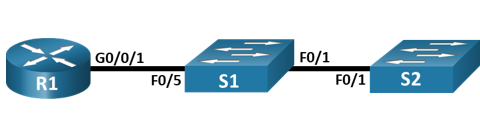
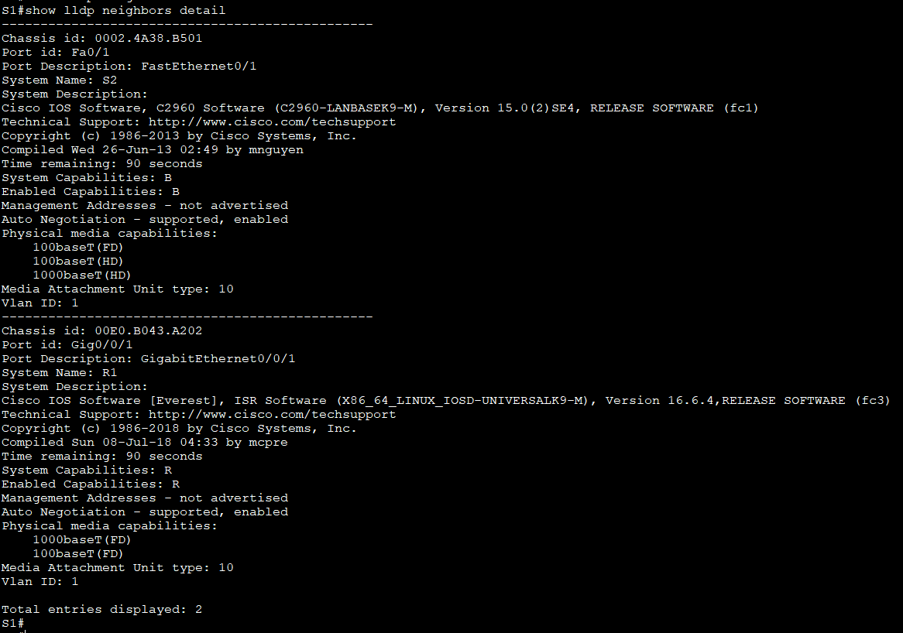
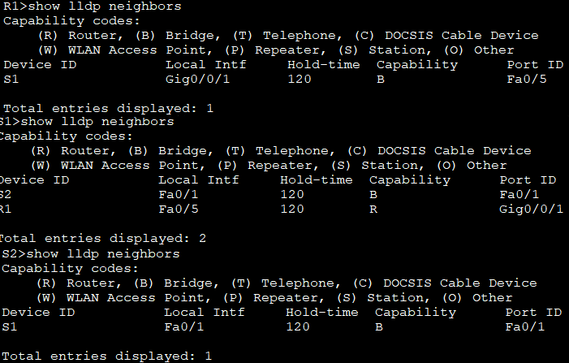
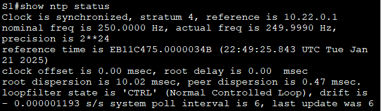
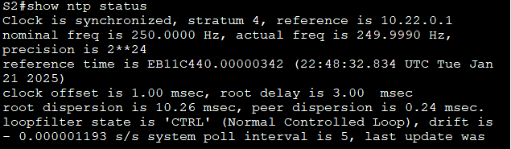

# Лабораторная работа - Настройка протоколов CDP, LLDP и NTP

Топология 



Таблица адресации:

|Устройство|Интерфейс|Ip-адрес|Маска подсети|Шлюз по умолчанию|
|:--------------:|:-----------:|:----------:|:------------:|:-----------:|
|R1|Loopback1<br/>G0/0/1|172.16.1.1<br/>10.22.0.1|255.255.255.0<br/>255.255.255.0|------<br/>------|
|S1|SVI VLAN 1|10.22.0.2|255.255.255.0|10.22.0.1|
|S2|SVI VLAN 1|10.22.0.3|255.255.255.0|10.22.0.1|

Задачи<br/>
Часть 1. Создание сети и настройка основных параметров устройства<br/>
Часть 2. Обнаружение сетевых ресурсов с помощью протокола CDP<br/>
Часть 3. Обнаружение сетевых ресурсов с помощью протокола LLDP<br/>
Часть 4. Настройка и проверка NTP<br/>

## Часть 1. Создание сети и настройка основных параметров устройства

Настройте базовые параметры для маршрутизатора.

```
enable
conf t
hostname R1
no ip domain-lookup
enable secret class

line console 0
password cisco
login

line vty 0 4
password cisco
login
exit

service password-encryption

banner motd "Alarm!"

interface loopback 1
ip address 172.16.1.1 255.255.255.0
exit

interface g0/0/1
ip address 10.22.0.1 255.255.255.0
no shutdown
end

copy run start

```
Настройте базовые параметры каждого коммутатора.

S1 и S2

```
enable 
conf t
hostname S1
no ip domain-lookup
enable secret class

line console 0
password cisco
login

line vty 0 4
password cisco
login
exit

service password-encryption

banner motd "Alarm!"
```
S1:
```
interface range f0/2-4, f0/6-24, g0/1-2
shutdown
end
copy run start

```
S2:
```
interface range f0/2-24, g0/1-2
shutdown
end
copy run start
```
### Часть 2. Обнаружение сетевых ресурсов с помощью протокола CDP

a.	На R1 используйте соответствующую команду show cdp, чтобы определить, сколько интерфейсов включено CDP, сколько из них включено и сколько отключено.


b.	На R1 используйте соответствующую команду show cdp, чтобы определить версию IOS, используемую на S1.


- Какая версия IOS используется на  S1?

__Version 15.0(2)SE4__

d.	Настройте SVI для VLAN 1 на S1 и S2, используя IP-адреса, указанные в таблице адресации выше. Настройте шлюз по умолчанию для каждого коммутатора на основе таблицы адресов.
S1 :
```
conf t
interface vlan 1
ip address 10.22.0.2 255.255.255.0
no shutdown
exit

ip default-gateway 10.22.0.1
end

copy run start
```
S2:
```
conf t
interface vlan 1
ip address 10.22.0.3 255.255.255.0
no shutdown
exit

ip default-gateway 10.22.0.1

copy run start

```
e.	На R1 выполните команду show cdp entry S1 . 


Какие дополнительные сведения доступны теперь?

__IP address: 10.22.0.2__

f.	Отключить CDP глобально на всех устройствах

```
conf t
no cdp run
```
#### Часть 3. Обнаружение сетевых ресурсов с помощью протокола LLDP

a.	Введите соответствующую команду lldp, чтобы включить LLDP на всех устройствах в топологии

```
conf t
lldp run
```
b.	На S1 выполните соответствующую команду lldp, чтобы предоставить подробную информацию о S2. 

```
show lldp neighbors detail
```


Что такое chassis ID  для коммутатора S2?

__Для S2 chassis ID 0002.4A38.B501  мак-адрес__



##### Часть 4. Настройка NTP

В части 4 необходимо настроить маршрутизатор R1 в качестве сервера NTP, а маршрутизатор R2 в качестве клиента NTP маршрутизатора R1. Необходимо выполнить синхронизацию времени для Syslog и отладочных функций. Если время не синхронизировано, сложно определить, какое сетевое событие стало причиной данного сообщения.

Введите команду show clock для отображения текущего времени на R1


С помощью команды clock set установите время на маршрутизаторе R1. Введенное время должно быть в формате UTC. 

```
clock set 22:33:00 21 JAN 2025
```
Настройте R1 в качестве хозяина NTP с уровнем слоя 4

```
conf t
ntp server master 3
```
 - Настройте S1 и S2 в качестве клиентов NTP. Используйте соответствующие команды NTP для получения времени от интерфейса G0/0/1 R1
Используйте соответствующую команду show , чтобы убедиться, что S1 и S2 синхронизированы с R1
S1 и S2:

```
conf t
ntp server 10.22.0.1
```




Для каких интерфейсов в пределах сети не следует использовать протоколы обнаружения сетевых ресурсов? 

__Интерфейсы подключенные к внешним сетям из-за угрозы безопасности так как эти протоколы предоставляют сведения о сетевых устройствах<br/>__